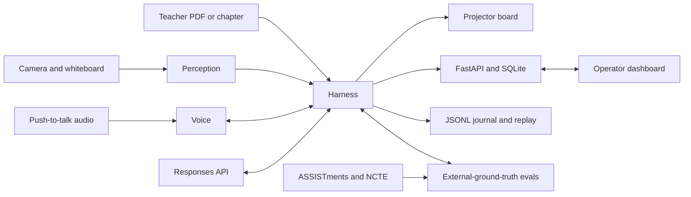

# Teacher Brain

Teacher Brain is an embodied teaching agent designed to run a real classroom from
teacher-authored source material. A frontier model provides the reasoning; the
harness provides the classroom: tools, learner memory, pedagogical context,
orchestration, perception, voice, and replayable journals.

The project evaluates its teaching claims against externally authored ground
truth. ASSISTments student histories measure learner-model calibration, and NCTE
classroom transcripts measure pedagogical discourse moves. We do not grade the
agent on examples it generated itself.

> Codebreaker measured whether agents can find and fix vulnerabilities in code.
> Teacher Brain measures whether agents can find and fix misconceptions in people.

## What It Does

- Ingests a teacher's PDF deck or textbook chapter and turns it into a validated,
  executable lecture plan.
- Drives a projector smartboard with text, math, plots, diagrams, slides, and
  narration-synchronized highlights.
- Pauses for student interruptions, answers in the student's declared language,
  revises the remaining lecture plan, and displays the plan diff.
- Maintains persistent, human-readable learner notes containing mastery estimates,
  misconceptions, participation, language, and strategies that worked.
- Inspects photographed whiteboard work, locates the first incorrect step, and
  responds with a Socratic hint before checking the correction.
- Tracks participation and preferentially offers accessible questions to students
  who have not yet contributed.
- Journals model calls, tool calls, perception events, and plan revisions so every
  classroom or evaluation session can be replayed.

## Architecture



The Python harness has five independently configurable layers:

1. **Tool surface:** strict schemas for board, voice, perception, assessment,
   learner memory, and lecture control.
2. **Learner-model memory:** model-authored Markdown notes per student, with
   `notes`, `full_context`, and `none` evaluation modes.
3. **Pedagogical context:** a math misconception taxonomy, NCTE-aligned discourse
   vocabulary, and policies for Socratic hints, language, and participation.
4. **Orchestration:** lecture ingestion and execution, pipelined beat generation,
   interruptions, plan revision, and the whiteboard feedback loop.
5. **Journaling and replay:** timestamped model/tool/perception records shared by
   live sessions and evaluation runs.

## Planned Repository Layout

```text
apps/
  dashboard/          React operator dashboard
  board/              Fullscreen projector smartboard
packages/
  harness/            Agent tools, memory, orchestration, and journaling
  perception/         Pose, seat regions, hand-raise FSM, board capture
  voice/              Streaming STT and TTS wrappers
  evals/               ASSISTments and NCTE evaluation suites
  shared/              Shared JSON schemas
server/                FastAPI, WebSocket hub, SQLite, and setup REST API
data/                  Local external datasets (gitignored)
scripts/               Setup, calibration, demo, replay, and eval runners
docs/                  Architecture, harness, evaluation, and demo documentation
```

## Evaluation

### ASSISTments

The long-horizon evaluation streams corrected and deduplicated ASSISTments
2009-10 skill-builder histories. After each chronological chunk, the agent updates
its learner notes and predicts the next response probability. AUC and Brier score
are compared with pyBKT and DKT baselines, including a learner-memory ablation.

### NCTE

The classroom-transcript evaluation scores MQI/CLASS dimensions and identifies
high-uptake and focusing-question moves against human annotations. A ghost
classroom mode also compares the harness's next move with annotated discourse
opportunities while showing the real teacher's move side by side.

Headline reporting will include full-harness lift over a bare model, memory and
pedagogy ablations, and total token usage. Dataset files are not committed; loaders
expect authorized copies under `data/`.

## Ethics and Privacy

These constraints are enforced in code and documentation:

- No demographic inference from camera input, including race, ethnicity, age, or
  immigration status.
- No facial emotion or "confusion" recognition.
- Camera processing is limited to presence in fixed seat regions, raised-hand
  detection, and requested whiteboard image capture.
- Student language and learner-profile information comes only from declared
  enrollment data.
- Stored student identifiers are first names or pseudonyms only.
- Secrets are supplied through environment variables and redacted from journals.

## Build Milestones

- **M0:** monorepo skeleton, shared schemas, FastAPI WebSocket echo, and a board
  action rendered from an injected request.
- **M1:** replayable ASSISTments and NCTE evaluation harnesses on initial subsets.
- **M2:** PDF-to-lecture board and streamed voice loop with synchronized deixis.
- **M3:** interruption, bilingual response, plan revision diff, and clean resume.
- **M4:** live pose/seat/hand perception and whiteboard first-error localization.
- **M5:** scaled evaluation runs and ablations.
- **M6:** ghost classroom, demo orchestration, documentation, and presentation polish.

## Status

M0 is complete: a curl-injected, schema-validated action renders on the live board
over FastAPI and WebSocket, including math and highlighting.

M1's harness, ASSISTments, NCTE Tier 1, reporting, and replay implementations pass
the local fixture suite. M1 is **not accepted yet** because the external dataset files
and `OPENAI_API_KEY` are not present in this checkout, so no real local agent numbers
have been produced. Checked-in reports state `UNAVAILABLE` and show zero local tokens.

## M0 Quick Start

Prerequisites are Python 3.11+ and Node.js 20+.

```bash
python3 -m venv .venv
.venv/bin/python -m pip install -e ".[dev]"
npm install
```

Start the API and projector app in separate terminals:

```bash
.venv/bin/python -m uvicorn server.app.main:app --host 127.0.0.1 --port 8000
npm run dev:board
```

Open `http://127.0.0.1:5173`, then inject and highlight a math element:

```bash
curl -X POST http://127.0.0.1:8000/api/board/actions \
  -H 'Content-Type: application/json' \
  -d '{"type":"board.write_math","region":"center","latex":"3x + 5 = 20","element_id":"demo-equation"}'

curl -X POST http://127.0.0.1:8000/api/board/actions \
  -H 'Content-Type: application/json' \
  -d '{"type":"board.highlight","element_id":"demo-equation","style":"pulse"}'
```

Run the automated checks with:

```bash
.venv/bin/python -m pytest
npm test
npm run typecheck
npm run build
npm run verify:m0  # requires the API and board dev servers
```

## M1 Evaluation Quick Start

The input contract and access requirements are documented in
[`docs/eval-methodology.md`](docs/eval-methodology.md). Once the authorized datasets
are under `data/` and `OPENAI_API_KEY` is set, run:

```bash
.venv/bin/python scripts/run_assistments_eval.py --max-students 5
.venv/bin/python scripts/run_ncte_eval.py --max-transcripts 10
```

Reports are written to `packages/evals/assistments/report.md` and
`packages/evals/ncte/report.md`. Session state and JSONL journals stay under the
gitignored `state/evals/` tree. See [`docs/harness.md`](docs/harness.md) for ablation,
memory, model-boundary, and deterministic replay details.
